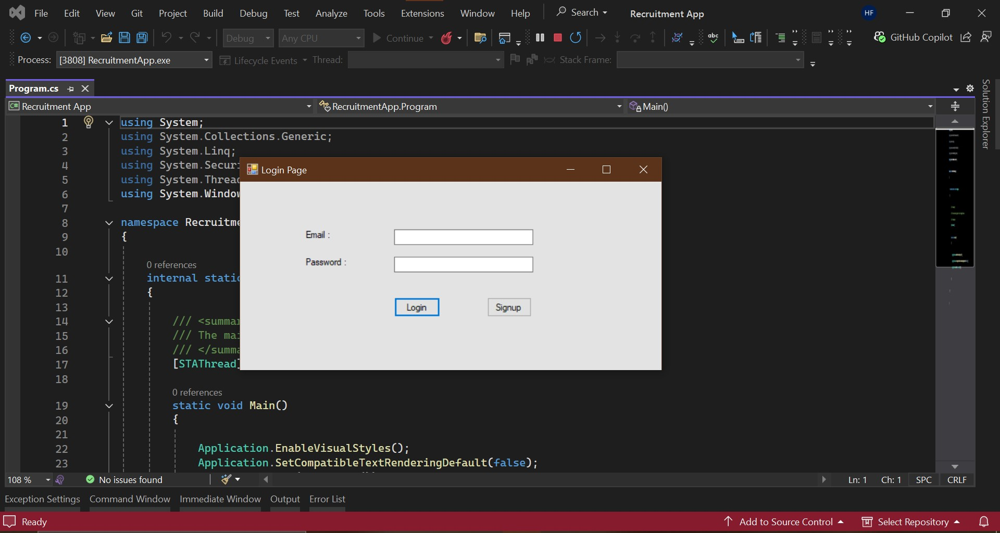

# Recruitment App

A Windows Forms-based Recruitment Application for managing user authentication, job seeker and employer workflows, built with C# and SQL Server.

## Features
- User Login & Role-based access
- Job Seeker & Employer forms
- SQL Server integration
- Windows Forms (WinForms) UI
- ADO.NET based data access

## Getting Started
1. Clone this repo.
2. Create 'Recuritment' Database on you local SQL server.
3. Excute the DDL and Sample Data Files in **ERD, DDL Script and Sample Dat** Folder.
4. Open the `.sln` file in Visual Studio.
5. Configure your database connection string in `App.config`.
6. Build and run the application.

## Requirements
- .NET Framework
- Visual Studio
- SQL Server (LocalDB or Express)

## Screenshots

## License
This project is licensed under the [MIT License](LICENSE).
